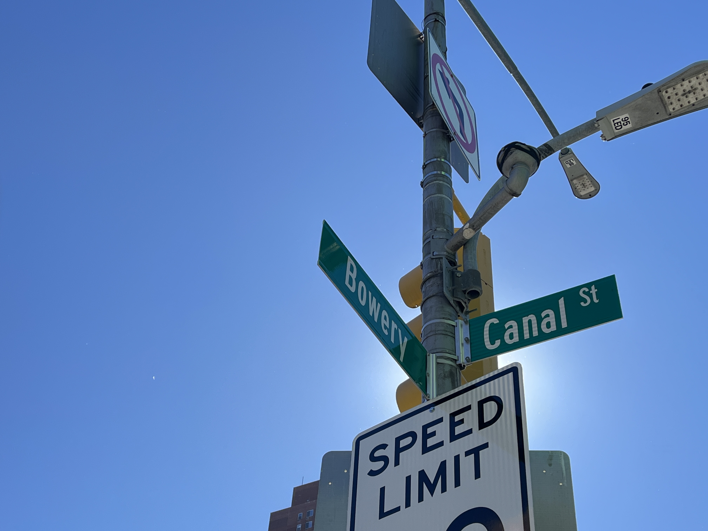

<!DOCTYPE html>
<html>
<head>
	<meta charset="utf-8">
	<meta name="viewport" content="width=device-width, initial-scale=1">
	<title>Charting Data</title>
	<link rel="stylesheet" type="text/css" href="style.css">
</head>

<body>

 <h1>Canal Street Safety Fixes Planned After Deadly High-Speed Crash
</h1>
    
Lower Manhattan’s Most Dangerous Corridor: Why Canal Street Needs Urgent Change

<figure class="center-image">
        
        <figcaption> The intersection sign of Canal Street and Bowery where a deadly high-speed crash happened in July.
 Photo Credit: Stephanie Hong

        </figcaption>
    </figure>

    <h4>By Stephanie Hong</h4>
    
Nov. 23, 2025

In the wake of a deadly Chinatown crash in which two pedestrians were killed by a drunk driver going more than 100 mph, the city’s Department of Transportation is rolling out new safety measures along Canal Street.

In the coming weeks, DOT will make a series of changes designed to boost safety, including narrowed lanes, lowered speed limits and the addition of physical barriers near where two men were killed in July.

Will Livingston, a spokesperson of NYC DOT spokesperson said, "DOT will narrow the two left-most Canal Street-bound lanes to ensure that drivers maintain safe speeds as they leave the bridge and enter the neighborhood streets of Chinatown.”

 

According to Livingston, NYC DOT will install concrete barriers and sand-filled barrels to protect the pedestrian space at Canal Street and Bowery. The DOT also will reduce the speed limit along the bridge approach to the intersection, lowering 35 mph to 20 mph to take place after a 60-day comment period.

 

<iframe title="Traffic Volume Counts at Peak-Time in Lower Manhattan" aria-label="Line chart" id="datawrapper-chart-k22MR" src="https://datawrapper.dwcdn.net/k22MR/2/" scrolling="no" frameborder="0" style="width: 0; min-width: 100% !important; border: none;" height="537" data-external="1"></iframe>

<iframe title="Lower Manhattan Sidewalk Width Comparison" aria-label="Bar Chart" id="datawrapper-chart-HMhmM" src="https://datawrapper.dwcdn.net/HMhmM/1/" scrolling="no" frameborder="0" style="width: 0; min-width: 100% !important; border: none;" height="404" data-external="1"></iframe>

<iframe title="Manhattan Street Mobile Vehicle Crash" aria-label="Table" id="datawrapper-chart-Y9BJD" src="https://datawrapper.dwcdn.net/Y9BJD/3/" scrolling="no" frameborder="0" style="width: 0; min-width: 100% !important; border: none;" height="419" data-external="1"></iframe>

</body>
</html>
